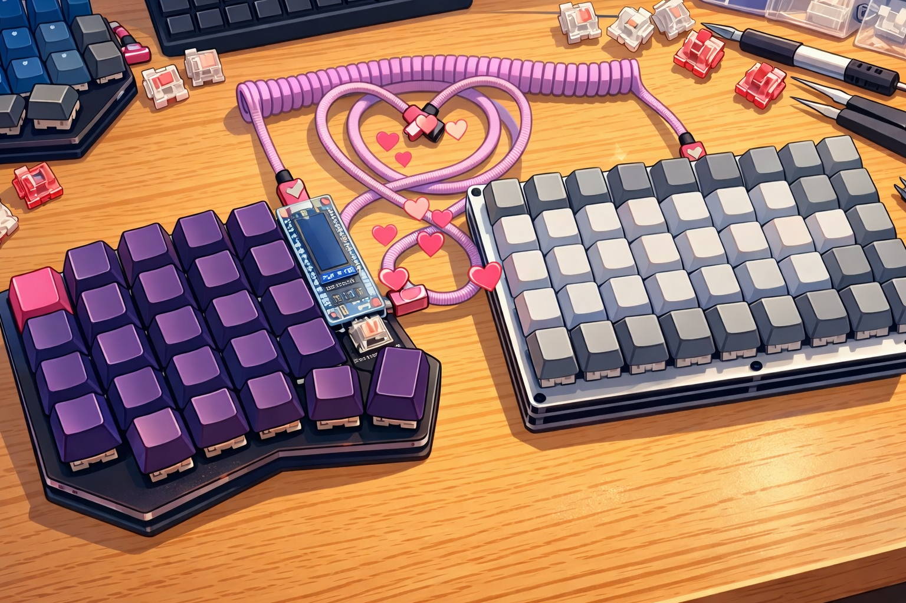

# BFS9000 — Proyecto paraguas (hardware + firmware + software)

> 🇬🇧 **Prefer to read this in English?** → [README.md](README.md)

Repositorio principal que engloba varios subproyectos alrededor del teclado **BFS9000** (hardware) y su ecosistema de **firmware QMK/Vial** y **software en PC** para controlar iluminación desde la red (Home Assistant vía MQTT, con un agente local que habla por USB con el teclado).

## Estructura del repositorio

- [`hardware/`](./hardware/) — diseño del teclado/PCB (BFS9000) y documentación asociada.
- [`firmware/`](./firmware/) — firmware basado en QMK/Vial (configuración, keymaps, etc.).
- [`software/`](./software/) — agente/CLI en PC (USB + MQTT + Home Assistant).
- [`hodgepodge/`](./hodgepodge/) — pruebas, experimentos y material auxiliar.

> Cada carpeta debería tener (o acabará teniendo) su propio README con instrucciones específicas.

## Motivación

Los teclados “estándar” nunca me encajaron: acababa colocándolos en diagonal y el escalonado clásico me terminó pasando factura (incomodidad y cierta deformación en los dedos). Hace unos ~10 años me metí en el mundillo de los teclados custom y empecé a buscar opciones divididas y más ergonómicas: primero miré diseños comerciales tipo ErgoDox, luego pasé por el Corne, hasta que por fin encontré el **[Sofle](https://github.com/josefadamcik/SofleKeyboard)**, diseñado y mantenido originalmente por **Josef Adamčík**. 

Mi primer teclado lo compré en **[Mechboards (UK)](https://mechboards.co.uk/)**. El primer intento de montaje fue un desastre, pero en mi caso se portaron muy bien con el soporte. (Ojo: la política actual de devoluciones/garantía puede diferir y, según indican, normalmente no cubre productos modificados/soldados; mejor revisarla antes de comprar.)
- Política actual (referencia): https://mechboardsuk.reamaze.com/kb/shipping-and-returns/returns-policy

El segundo Sofle fue un **Sofle RGB** de **[KeyHive](https://keyhive.xyz/shop/sofle)**. En el ecosistema Sofle, la variante **Sofle RGB** (RGB por tecla + underglow) se atribuye como contribución de **Dane Evans** al proyecto del Sofle.

Con el tiempo he tenido otros teclados con ligeras modificaciones basados en Sofle e incluso he llegado a mandar fabricar PCBs propias. El cambio se notó de verdad: mis dedos mejoraron e incluso mi velocidad aumentó; de hecho, ahora cuando vuelvo a un teclado escalonado me siento torpísimo.

Aun así, aunque configuré capas y aprendí a usarlas con soltura, no soy de “vivir” en capas, y tras unos ~8 años usando Sofle decidí probar un **[BFO9000](https://docs.keeb.io/bfo-9000-build-guide)** (de **Keebio**) en su configuración completa. En ergonomía me gusta bastante menos, pero para el día a día me resolvía mejor:

Con el tiempo pensé que esa sensación de “echar de menos” el Sofle se me pasaría… pero no fue así. Por eso estoy en el proceso de crear un **BFS9000**, basado en la última iteración de JellyTitan llamada **[Sofle-Pico](https://github.com/JellyTitan/Sofle-Pico)**:

## Subproyectos (enlaces rápidos)

- Hardware BFS9000: [`hardware/`](./hardware/)
- Firmware (QMK/Vial): [`firmware/`](./firmware/)
- Software (agente PC / MQTT / HA): [`software/`](./software/)
- Material auxiliar: [`hodgepodge/`](./hodgepodge/)

## Referencias

### Diseños
- Sofle (Josef Adamčík): https://github.com/josefadamcik/SofleKeyboard
- Sofle-Pico (JellyTitan): https://github.com/JellyTitan/Sofle-Pico
- Proyecto / docs Sofle-Pico: https://www.soflepico.com/
- BFO-9000 (Keebio): https://docs.keeb.io/bfo-9000-build-guide

### Tiendas
- Mechboards: https://mechboards.co.uk/
- KeyHive (Sofle RGB): https://keyhive.xyz/shop/sofle

### Firmware / HA
- Vial (manual): https://get.vial.today/manual/
- Home Assistant MQTT: https://www.home-assistant.io/integrations/mqtt/
- Home Assistant MQTT Light: https://www.home-assistant.io/integrations/light.mqtt/

## Licencia

Pendiente de definir.

