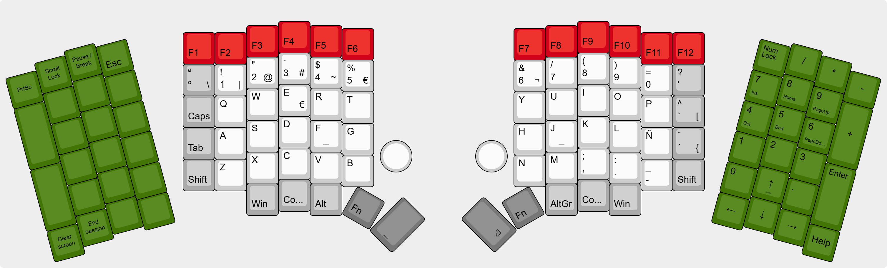

# BFS9000

> 🇬🇧 **Prefer to read this in English?** → [README.md](README.md)

PCB de teclado ergonómico **split** y **custom**, basado en **Sofle-Pico** (RP2040/Pico). Placas reversibles (la misma PCB sirve para izquierda/derecha) para reducir costes de fabricación y simplificar el montaje. Añade fila de función y packs laterales “breakaway”, RGB por tecla **SK6803MINI-E**, underglow trasero, identificación automática de lado, soporte opcional para touchpad Cirque y protección ESD **USBLC6-2SC6**.

## Alcance del proyecto: “Baseline completo de Sofle-Pico + modificaciones propias (según el layout proporcionado)”

### Referencias
- Sofle-Pico (JellyTitan): https://github.com/JellyTitan/Sofle-Pico
- Web/docs del proyecto: https://www.soflepico.com/

---

## A) Requisitos base de Sofle-Pico (deben incluirse)

1. PCB de teclado ergonómico split (dos mitades).
2. Huella/soporte para controlador clase RP2040 Pico (Pico / compatible).
3. Interconexión tipo TRRS entre mitades (tener en cuenta riesgos de hot-plug).
4. Switches MX con sockets hot-swap (Sofle-Pico base usa enfoque hot-swap).
5. Matriz de teclas con diodos por tecla (1 diodo por tecla; también diodos para encoders).
6. Doble OLED (SSD1306 128x64, I²C): una por mitad.
7. Soporte para dos encoders rotatorios (uno por mitad).
8. Cadena de LEDs direccionables por tecla (en serie / daisy-chain).
9. Componentes de alimentación según el baseline de Sofle-Pico (incluyendo diodo(s) Schottky para ruta/aislamiento de alimentación).

---

## B) Modificaciones personalizadas sobre el baseline

### 1) Fila superior de función desmontable [ROJO] (sección breakaway)
- Añadir una fila de teclas de función arriba en **AMBOS** lados (izquierda y derecha).
- Debe poder retirarse mecánicamente (mouse-bites / pestañas breakaway).
- Retirarla **NO** debe romper: el escaneo de la matriz, la continuidad de la cadena de datos RGB ni la distribución de alimentación.

### 2) Packs laterales desmontables [VERDE] (secciones breakaway)
- Añadir packs laterales en **AMBOS** lados (izquierda y derecha).
- Deben poder retirarse mecánicamente (mouse-bites / pestañas breakaway).
- Retirarlos **NO** debe romper: el escaneo de la matriz, la continuidad de la cadena de datos RGB ni la distribución de alimentación.

### 3) RGB por tecla en todas las teclas añadidas + selección del LED
- Todas las teclas adicionales deben tener 1 LED RGB por tecla.
- El LED **DEBE** ser: **SK6803MINI-E** (RGB direccionable SMD).

### 4) Underglow / LEDs traseros
- Mitades principales: **6** LEDs RGB orientados hacia atrás por mitad.
- Packs laterales: **4** LEDs RGB orientados hacia atrás por pack.

### 5) Detección automática de lado
- Cada mitad debe incluir un método de identificación por resistencias para que el firmware detecte automáticamente izquierda vs derecha.
- Documentar el/los valores de resistencia + método de medida (divisor a ADC o pin de ID mediante resistencia, etc.) y asegurar compatibilidad con el firmware.

### 6) Soporte opcional para touchpad Cirque
- Touchpad Cirque opcional en la esquina inferior izquierda de la **MITAD DERECHA**.
- Preferible interfaz I²C (compartiendo/conviviendo con el bus I²C del OLED si aplica).
- Incluir: keep-out mecánico, tipo de conector/huella, estrategia de pull-ups y mapeo de pines para firmware.

### 7) Protección eléctrica (hot-plug TRRS / ESD)
- Añadir protección ESD/transitorios como **USBLC6-2SC6** (o equivalente) en las líneas externas relevantes.
- Tener en cuenta: cortos momentáneos al hot-plug del TRRS, exposición ESD y evitar inyección de sobretensión/corriente en GPIOs del MCU.

---

## C) Recuento final según el layout proporcionado (para presupuesto/BOM)

- **Teclas totales:** 116  
  - Mitad principal: 36 teclas por lado (72 total)  
  - Pack lateral: 22 teclas por lado (44 total)
- **LEDs RGB por tecla (SK6803MINI-E):** 116
- **Underglow/traseros:** 20 (12 mitades principales + 8 packs laterales)
- **LEDs RGB totales (por tecla + underglow):** 136

