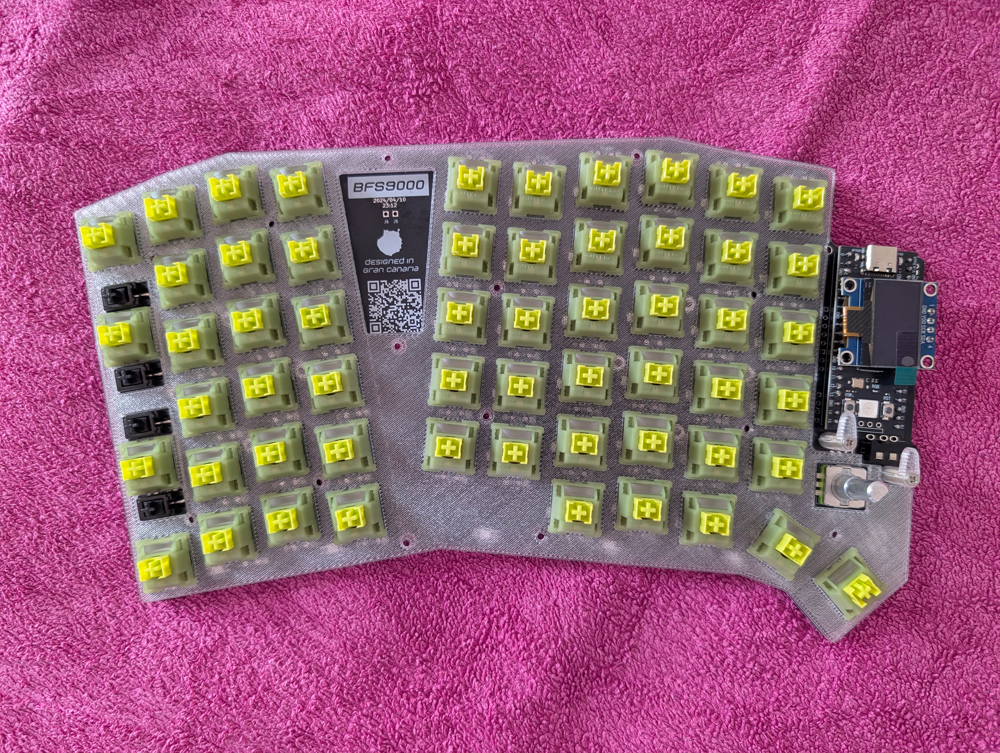
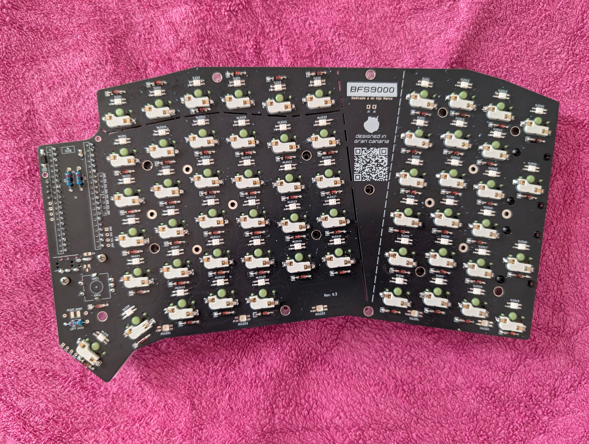
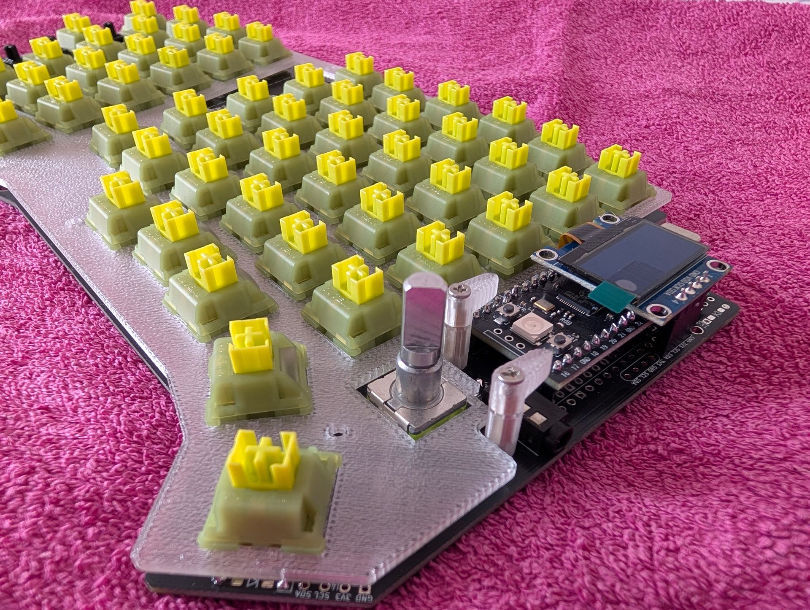
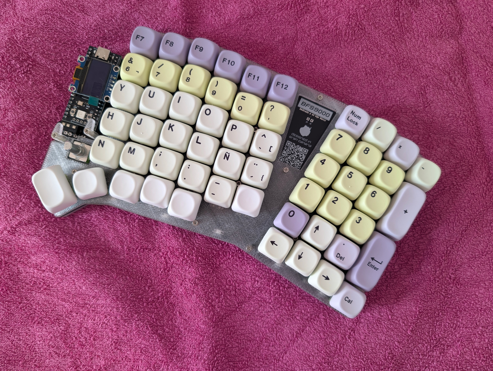
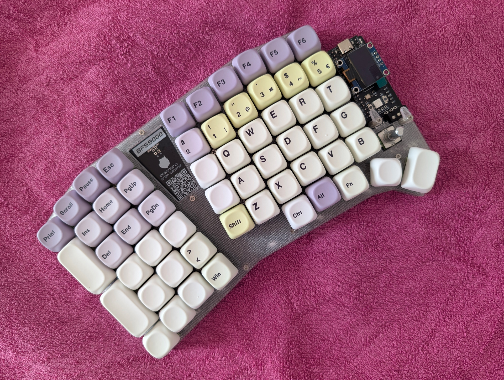
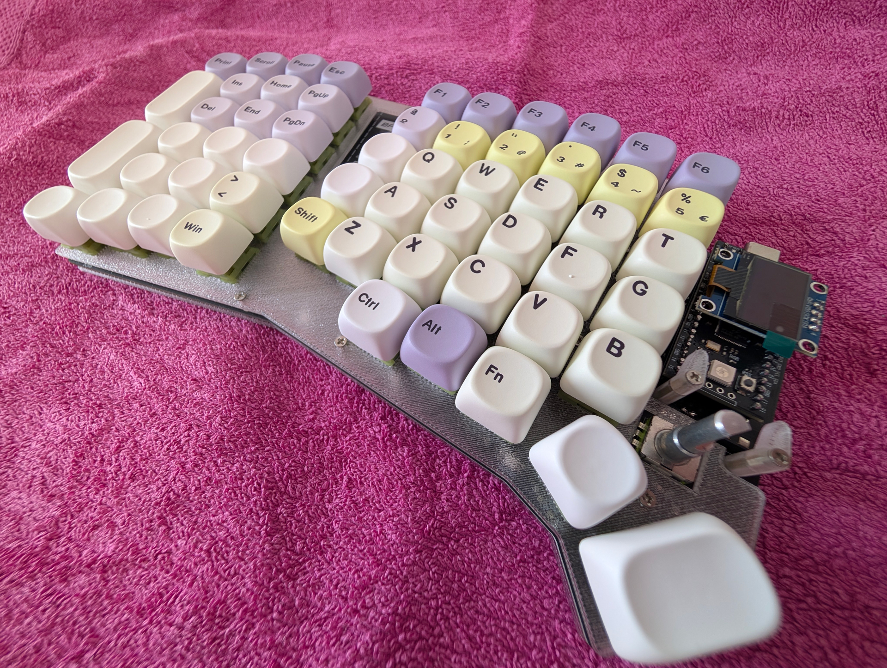
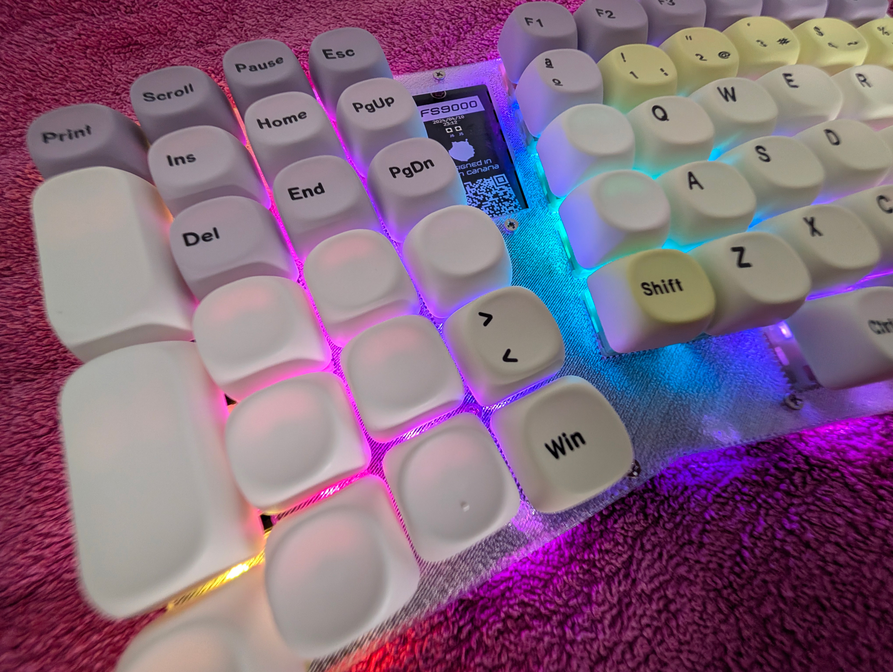

# Isabel Love's BFS9000
## Español

Estoy utilizando la configuración completa del teclado en ambas mitades. Para los sockets hot-swap he montado **Durock**, junto con interruptores **Outemu Silent Peach V3** y keycaps **PBT Taro** con perfil **MOA**. También he instalado separadores de **7 mm**, que encajan y funcionan sin ningún problema.

---

## English

I'm using the full keyboard configuration on both halves. For the hot-swap sockets, I'm using **Durock** sockets, along with **Outemu Silent Peach V3** switches and **PBT Taro** keycaps with the **MOA** profile. I also installed **7 mm** standoffs, which fit and work perfectly without any issues.

## Photos

  

  
  
  

  
  

  
  

